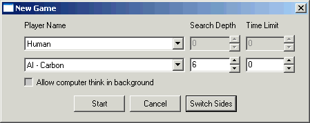
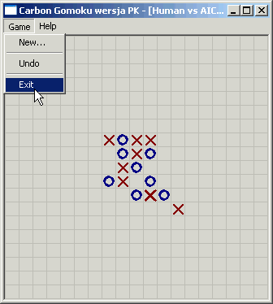

Gomoku game (Five in a Row) playing program with a strong artificial intelligence algorithm (evaluation function, mini-max with cut offs, alpha-beta, transposition table, situation signatures, candidate generating). Documented in author's native language (Polish) - see Documentation_PL folder. The algorithm was one of the strongest in 2002 (the project is over 13 years old!).

* Original author: Michał Czardybon
* Original website: http://mczard.republika.pl/gomoku.en.html
* Programming language: C++
* OS: Windows

Visual Studio solution includes 2 projects:
- CarbonAI project creates executable which can be used to play game in [Piskvork](https://sourceforge.net/projects/piskvork/). It can also participate in the [Gomocup tournament](http://gomocup.org/).
- Gomoku project is simple standalone UI. 

Tags: Five in a Row, Tic Tac Toe, TicTacToe, 5 in a Row, Go-Moku, Connect5, Caro, Noughts and Crosses, Renju, Pente, Piskvork, Amoba, Kółko i Krzyżyk, Gomocup, Pbrain, Gra, Board Game

